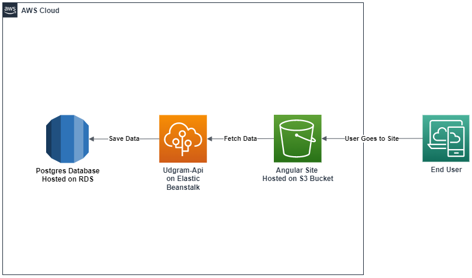

# App Infrastructure

## Used Services:
 -  S3 For static hosting frontend service http://fullstack-front.s3-website-us-east-1.amazonaws.com/
 -  Elastic Beanstalk for deploying backend server http://fullstackbackend-env.eba-m3vpum5y.us-east-1.elasticbeanstalk.com/
 -  RDS for hosting PostgresSQl server

